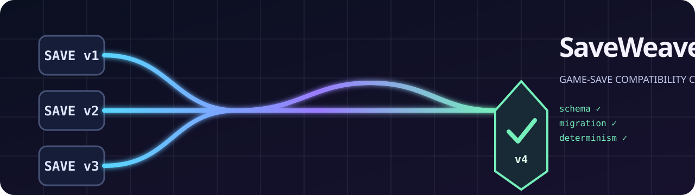

# SaveWeaver



[](https://github.com/KanadeK/saveweaver/actions/workflows/ci.yml)
[](https://github.com/KanadeK/saveweaver/actions/workflows/security.yml)
[](https://github.com/KanadeK/saveweaver/releases)
[](LICENSE)

**CI for the save files your players already have.**

SaveWeaver is an engine-agnostic CLI, JavaScript library, and GitHub Action for
shipping game-save changes without abandoning old saves. It applies a
declarative migration chain, validates every version against a focused JSON
Schema contract, proves deterministic and idempotent output with real save
fixtures, locks migration history by SHA-256, and emits a receipt for every
written save.

[中文说明](docs/README.zh-CN.md) ·
[live example matrix](docs/example-matrix.md) ·
[migration format](docs/migration-format.md) ·
[architecture](docs/architecture.md) ·
[repair playbook](docs/repair-playbook.md)

## Why this exists

A schema validator can tell you whether today's save is valid. It cannot tell
you whether a player save from six releases ago still reaches today's schema,
whether someone silently edited an already-shipped migration, whether the
migration is deterministic, or whether a failed in-place upgrade preserved the
original file.

SaveWeaver makes those questions executable:

```text
v1 fixture ── 001-player-progression ──> v2 ── 002-profile-wallet ──> v3
    │                                            │                    │
 schema v1                                   schema v2             schema v3
    └──────── source validation ───────────────┴──── target validation ┘
                                  +
               deterministic replay + idempotency + SHA-256 lock
```

## Try the real example

Requirements: Node.js 20 or newer. SaveWeaver has zero runtime dependencies.

```sh
git clone https://github.com/KanadeK/saveweaver.git
cd saveweaver
node bin/saveweaver.js matrix --project examples/space-ranger
```

Expected result:

```text
PASS fixtures/v1/fresh-cadet.json  v1 -> v3  001-player-progression -> 002-profile-wallet
PASS fixtures/v1/veteran.json      v1 -> v3  001-player-progression -> 002-profile-wallet
PASS fixtures/v2/shipyard.json     v2 -> v3  002-profile-wallet
PASS fixtures/v3/current.json      v3 -> v3  already current

4/4 fixtures passed; 0 failed.
```

This is not canned output. The command reads four save files, validates their
source contracts, runs the migration graph, validates every intermediate
contract, repeats each migration to check determinism, and migrates the final
output again to check idempotency.

## Install

From a GitHub Release tarball:

```sh
npm install --global ./saveweaver-v0.1.1.tgz
saveweaver --version
```

Or unpack the portable ZIP and run `saveweaver.cmd` on Windows or
`./saveweaver` on macOS/Linux. The portable bundle still requires Node.js 20+,
but it has no install step and no downloaded dependencies.

For development:

```sh
node "path/to/npm-cli.js" install
node bin/saveweaver.js --help
```

On a normal Node installation, `npm install` is equivalent. The explicit
`npm-cli.js` form avoids Windows process-launch edge cases in automated tools.

## Start a save contract

```sh
saveweaver init save-contract
cd save-contract
saveweaver check
```

`init` refuses to touch a non-empty directory. It creates a v1 schema, a real
fixture, a config, and a contract lock that already pass the gate.

A project config looks like this:

```json
{
  "format": 1,
  "name": "space-ranger",
  "current_version": 3,
  "version_pointer": "/meta/save_version",
  "schemas": {
    "1": "schemas/v1.schema.json",
    "2": "schemas/v2.schema.json",
    "3": "schemas/v3.schema.json"
  },
  "migrations": [
    "migrations/001-player-progression.json",
    "migrations/002-profile-wallet.json"
  ],
  "fixture_dirs": ["fixtures"],
  "lock_file": ".saveweaver.lock.json",
  "policy": {
    "require_all_schemas": true
  }
}
```

Paths must remain inside the project. Each historical schema version must have
one unambiguous forward path to `current_version`.

## Write a migration

Migrations are data, not arbitrary scripts:

```json
{
  "id": "002-profile-wallet",
  "from": 2,
  "to": 3,
  "description": "Split player data while rebalancing experience.",
  "operations": [
    {
      "op": "move",
      "from": "/player/name",
      "to": "/profile/display_name",
      "create_parents": true
    },
    {
      "op": "number",
      "path": "/player/experience",
      "multiply": 1.2,
      "round": "floor"
    },
    {
      "op": "set_default",
      "path": "/wallet/tokens",
      "value": 0,
      "create_parents": true
    }
  ]
}
```

Available operations are `assert`, `copy`, `delete`, `for_each`, `map_value`,
`move`, `number`, `rename`, `set`, and `set_default`. See the
[migration reference](docs/migration-format.md) for failure semantics and
examples.

## Preview and migrate safely

Preview the exact chain and structural diff:

```sh
saveweaver plan player-save.json --project save-contract
saveweaver migrate player-save.json --project save-contract --dry-run
```

Write a separate output:

```sh
saveweaver migrate player-save.json \
  --project save-contract \
  --out player-save-v3.json
```

An existing separate output is refused unless `--overwrite` is explicit.

Or explicitly migrate in place:

```sh
saveweaver migrate player-save.json --project save-contract --in-place
```

In-place mode first writes a content-addressed backup under
`.saveweaver-backups/`. Output is then written through a temporary file and
atomic rename. A successful migration also writes
`<output>.saveweaver-receipt.json`, containing source/output hashes, migration
hashes, versions, and field-level changes.

Verify a handoff:

```sh
saveweaver verify-receipt \
  player-save-v3.json.saveweaver-receipt.json \
  player-save-v3.json
```

## Gate a release

```sh
saveweaver lock
saveweaver check
```

`lock` records the SHA-256 of the config, schemas, and migration files.
`check` requires that lock to match and that all fixture rows pass.

Use the bundled GitHub Action:

```yaml
name: Save compatibility
on:
  pull_request:
  push:
    branches: [main]

jobs:
  saves:
    runs-on: ubuntu-latest
    steps:
      - uses: actions/checkout@v7
      - uses: KanadeK/saveweaver@v0.1.1
        with:
          project: path/to/save-contract
```

The Action writes a Markdown matrix to the job summary and fails on contract
drift, an invalid source fixture, a broken migration, a target-schema failure,
nondeterminism, or non-idempotent current output.

## Detect contract breaks before writing a migration

```sh
saveweaver schema-diff schemas/v2.schema.json schemas/v3.schema.json
```

The command exits non-zero for type narrowing, newly required fields, enum
narrowing, tighter numeric or collection bounds, and newly forbidden unknown
properties. Optional additions are informational; removed documented
properties are warnings.

## Supported schema surface

SaveWeaver deliberately supports a focused, offline JSON Schema 2020-12
surface used by game saves:

- local `$ref` and `$defs`;
- `type`, `required`, `properties`, `additionalProperties`, `items`;
- `const`, `enum`, `allOf`, `anyOf`, `oneOf`, `not`;
- number, string, array, and object bounds;
- patterns, uniqueness, and common annotation keywords.

Unsupported validation keywords are errors. SaveWeaver never silently accepts
a keyword it does not implement. See [migration format and schema
support](docs/migration-format.md#schema-support).

## Library API

```js
import { loadProject, migrateDocument } from "game-saveweaver";

const project = await loadProject("./save-contract");
const result = migrateDocument(project, oldSave);

console.log(result.output);
console.log(result.steps);
console.log(result.outputHash);
```

The migration engine clones its input before applying operations. A thrown
error cannot leave the caller's object partially migrated.

## Commands

| Command | Purpose |
| --- | --- |
| `init` | Create a safe, runnable v1 contract in an empty directory |
| `check` | Verify the contract lock and full fixture matrix |
| `matrix` | Test fixtures and emit text, JSON, or Markdown |
| `plan` | Preview a migration chain and structural diff |
| `migrate` | Dry-run, write a new save, or explicitly migrate in place |
| `lock` | Write or verify migration/schema SHA-256 history |
| `schema-diff` | Detect breaking contract changes |
| `verify-receipt` | Check an output save against its audit receipt |

## Repository quality gate

The release gate is:

```sh
node scripts/verify.mjs
```

It performs syntax/JSON/link/secret checks, formatting checks, 89 tests with
coverage thresholds, the example contract lock, the four-row compatibility
matrix, deterministic npm/portable packaging, checksums, a clean temporary
package install, and an installed-CLI matrix smoke test.

For the exact expected evidence and individual repair commands, see
[acceptance](docs/acceptance.md) and the [repair
playbook](docs/repair-playbook.md).

## Scope

SaveWeaver handles JSON save contracts owned by a game team. It does not
decrypt proprietary saves, discover player save locations, upload data, or
replace player-side backup tools. Binary formats can use SaveWeaver after the
game's own decoder produces JSON and before its encoder writes the migrated
state.

The opportunity scan and differentiation are documented in
[competitor scan](docs/competitor-scan.md). Popularity is never guaranteed, but
the project is designed around a broad, costly, underserved release problem
rather than a single-engine demo.

## Contributing and security

See [CONTRIBUTING.md](CONTRIBUTING.md), [SECURITY.md](SECURITY.md), and
[CODE_OF_CONDUCT.md](CODE_OF_CONDUCT.md). SaveWeaver is available under the
[MIT License](LICENSE).
